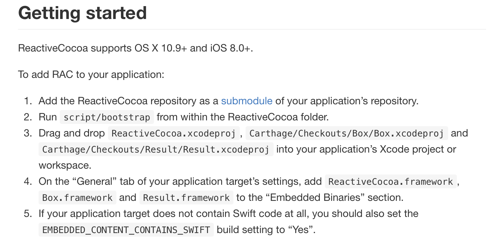
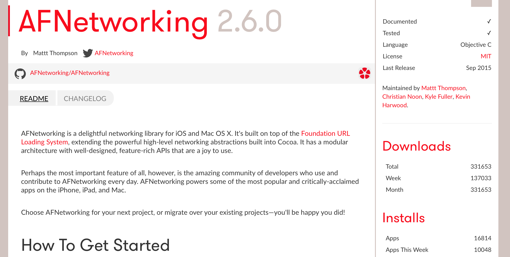
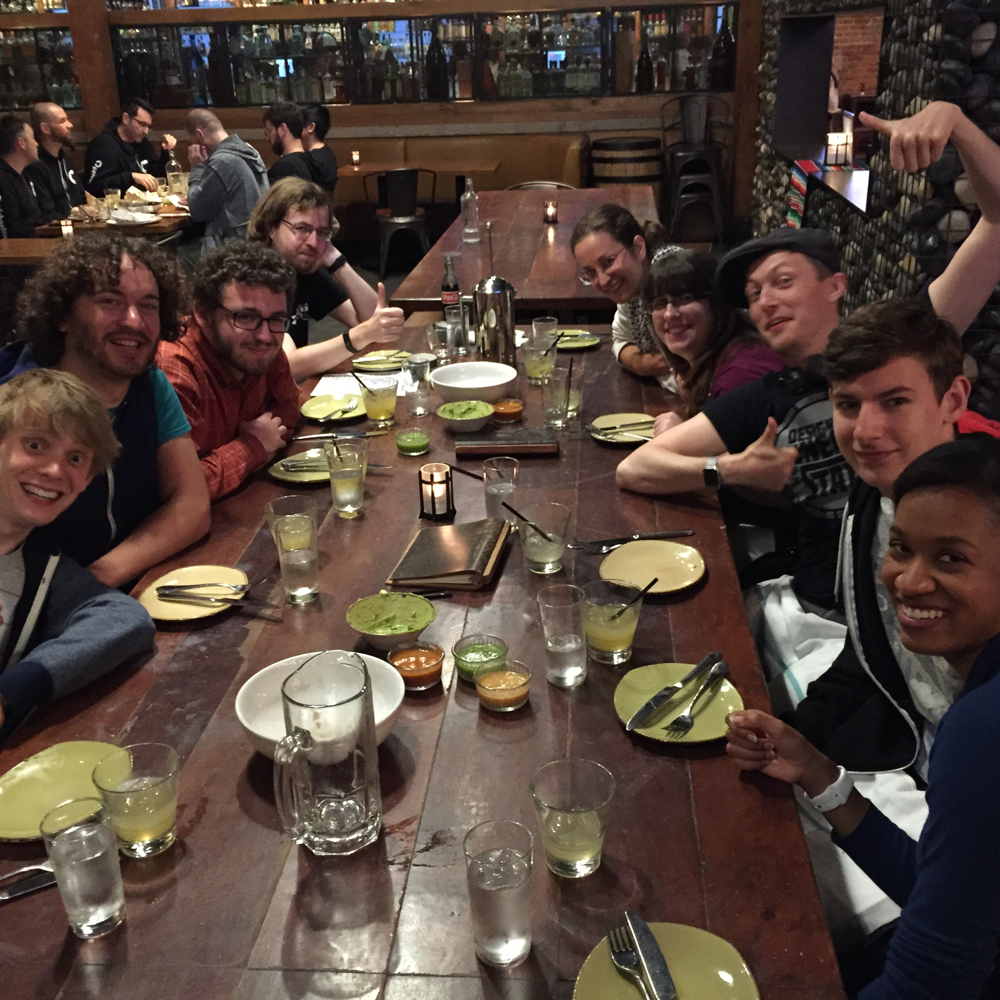

# CocoaPods

## OpenSourceBash, September 2015

### Boris Bügling - @NeoNacho


<!--- use Sketchnote theme, white -->

---

## CocoaPods is the dependency manager for Swift and Objective-C Cocoa projects.


---


---

# Reducing this




---

# to this

```ruby
pod 'ReactiveCocoa'
```


---

# but also

- Declarative language for libraries
- Transitive dependencies
- Discovery of new libraries
- Plugin system


---

# podspec

```ruby
Pod::Spec.new do |s|
  s.name             = "Contentful"
  s.version          = "0.1.0"
  s.summary          = "Swift SDK for Contentful's Content Delivery API."
  s.homepage         = "https://github.com/contentful/contentful.swift/"
  s.social_media_url = 'https://twitter.com/contentful'

  s.license = {
    :type => 'MIT',
    :file => 'LICENSE'
  }

  s.authors      = { "Boris Bügling" => "boris@buegling.com" }
  s.source       = { :git => "https://github.com/contentful/contentful.swift.git",
                     :tag => s.version.to_s }
  s.requires_arc = true

  s.source_files         = 'Code/*.swift'

  s.ios.deployment_target     = '9.0'
  s.osx.deployment_target     = '10.11'

  s.dependency 'Interstellar', '~> 1.1.0'
end
```

---

```bash
$ pod install
Analyzing dependencies
Downloading dependencies
Using Interstellar (1.1.0)
Using Nimble (2.0.0-rc.3)
Using Quick (0.6.0)
Generating Pods project
Integrating client project
Sending stats
```

---

# Technologies

- Written in Ruby
- Relies heavily on Xcode


---

# Websites


---




---


---

# Community


---

# Test Jam 2015


---

# Contributor Coins


<!-- top 80 contributors of CocoaPods/CocoaPods -->

---

# RailsGirls Summer of Code




---

# Contributing


---

# Resources

- <http://cocoapods.org>
- <http://blog.cocoapods.org/starting-open-source/>
- <https://github.com/CocoaPods/CocoaPods/labels/d1%3Aeasy>


